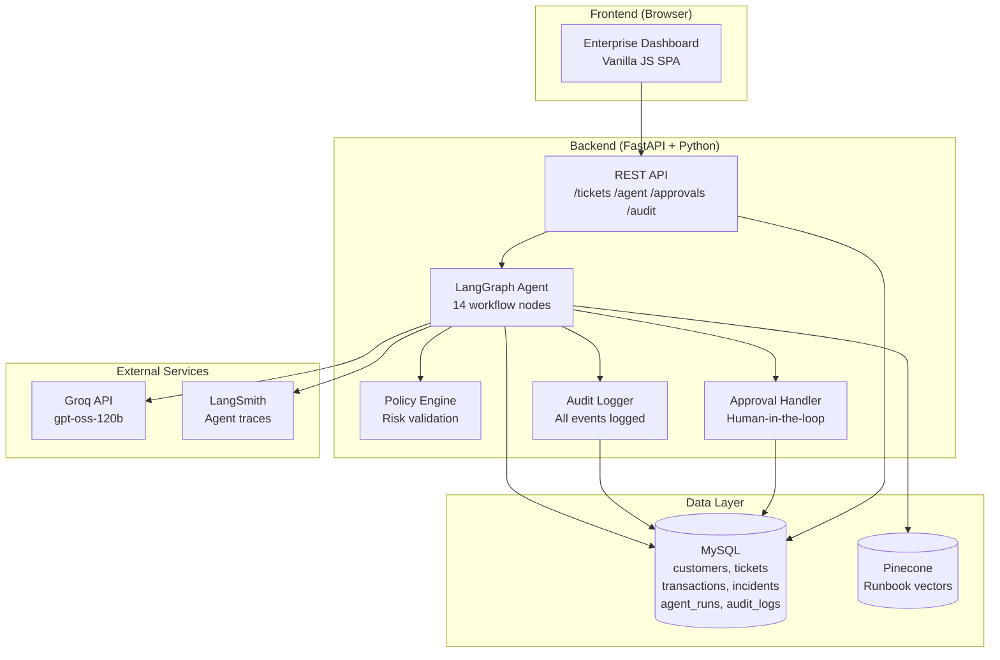
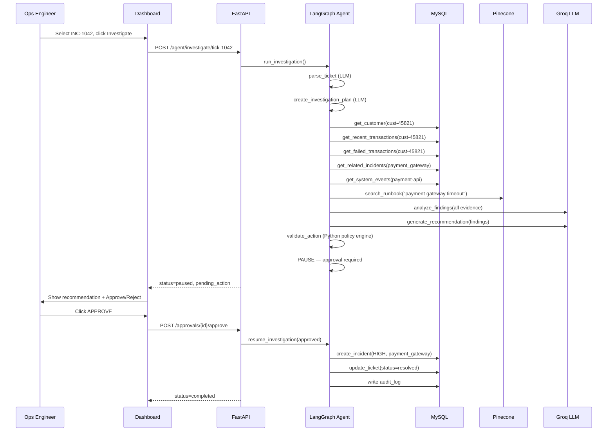
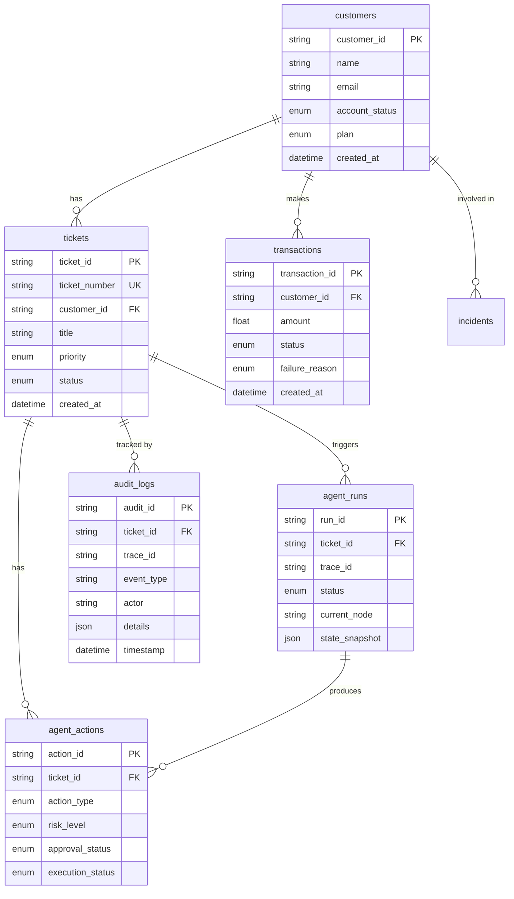
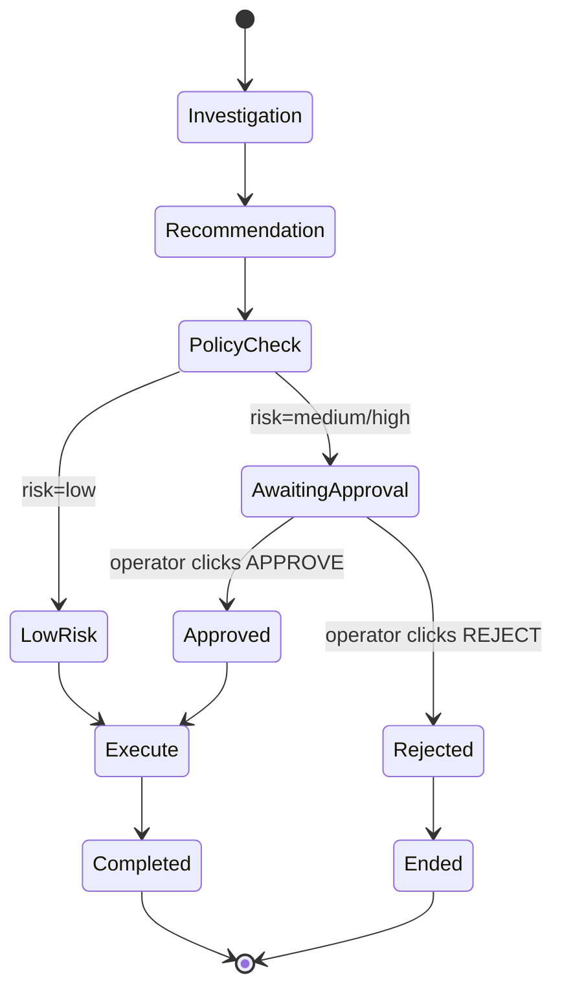

# OpsPilot — AI Operations Workflow Agent

> An AI-powered operations platform that automatically investigates operational tickets, gathers evidence from structured databases and operational runbooks, generates risk-aware recommendations, requires human approval before consequential actions, and maintains complete audit trails.

[](https://github.com/your-org/ops-workflow-agent/actions)
[](https://www.python.org/downloads/)
[](https://fastapi.tiangolo.com)
[](https://github.com/langchain-ai/langgraph)

---

## Business Problem

Operations teams spend significant time manually investigating tickets before deciding what to do:

- Manually querying databases for customer and transaction history
- Searching through runbooks for relevant procedures  
- Correlating multiple data sources to identify root causes
- Assessing risk before taking action
- Documenting all steps for audit compliance

**OpsPilot automates this entire workflow** while keeping humans in control of consequential actions.

---

## Solution

```
Ticket Received
      ↓
Parse & Structure
      ↓
Create Investigation Plan
      ↓
Query Customer Database        ← MySQL (read-only)
      ↓
Analyze Transactions
      ↓
Search Incidents
      ↓
Check System Events
      ↓
Retrieve Runbook Context       ← Pinecone (vector search)
      ↓
Analyze All Evidence           ← Groq LLM
      ↓
Generate Recommendation        ← Structured output
      ↓
Policy / Risk Validation       ← Python code (not LLM)
      ↓
Human Approval Required?
  ├── Yes → Display to operator → APPROVE / REJECT
  └── No  → Execute automatically
      ↓
Execute Approved Action
      ↓
Update Ticket
      ↓
Audit Log + LangSmith Trace
```

---

## Architecture



---

## Workflow



---

## Tech Stack

| Layer | Technology |
|-------|-----------|
| Frontend | HTML, CSS, Vanilla JavaScript |
| Backend | Python 3.11, FastAPI, Pydantic |
| Agent | LangGraph, LangChain |
| LLM | Groq API (`openai/gpt-oss-120b`) |
| Database | MySQL 8.0, SQLAlchemy |
| Vector DB | Pinecone |
| Embeddings | sentence-transformers (`all-MiniLM-L6-v2`) |
| Observability | LangSmith |
| Testing | Pytest |
| DevOps | Docker, Docker Compose, GitHub Actions |

---

## Database Design



---

## Agent Design

### State (OpsState)

```python
class OpsState(TypedDict):
    ticket_id: str
    run_id: str
    trace_id: str
    ticket: dict
    parsed_ticket: dict
    investigation_plan: list
    customer: dict
    transactions: list
    failed_transactions: dict
    incidents: list
    system_events: list
    runbook_context: list
    findings: dict
    recommended_action: dict
    validated_action: dict
    approval_status: str      # pending | approved | rejected | not_required
    execution_result: dict
    workflow_status: str      # running | paused | completed | failed | rejected
```

### Tools

| Tool | Type | Description |
|------|------|-------------|
| `get_customer` | Read | Retrieve customer profile |
| `get_recent_transactions` | Read | Last N transactions |
| `get_failed_transactions` | Read | Failed txns with breakdown |
| `get_related_incidents` | Read | Open incidents |
| `get_system_events` | Read | Infrastructure events |
| `search_runbook` | Read | Pinecone RAG search |
| `create_incident` | Write | Create operational incident |
| `update_ticket` | Write | Update ticket status/notes |
| `add_ticket_note` | Write | Append note to ticket |

All tool inputs are validated with Pydantic. The LLM never receives raw SQL access.

### Policy Engine

Risk levels and approval requirements are enforced in Python — the LLM **cannot** bypass them:

| Action | Risk | Approval Required |
|--------|------|-------------------|
| ADD_TICKET_NOTE | LOW | ❌ |
| UPDATE_TICKET | LOW | ❌ |
| CREATE_INCIDENT | MEDIUM | ✅ |
| NOTIFY_OPERATIONS | MEDIUM | ✅ |
| RESTART_SERVICE | HIGH | ✅ |
| DISABLE_ACCOUNT | HIGH | ✅ |

---

## RAG Architecture

```
data/runbooks/
  payment_gateway_timeout.md
  payment_failure.md
  duplicate_payment.md
  failed_refund.md
  account_lock.md
  incident_escalation.md
         ↓
  Document Loader
         ↓
  RecursiveCharacterTextSplitter
  (800 char chunks, 100 overlap)
         ↓
  sentence-transformers
  all-MiniLM-L6-v2 (local, free)
         ↓
  Pinecone Index
  (ops-runbooks)
         ↓
  search_runbook(query) → top-4 chunks
```

Embeddings run locally — no additional API key required beyond Pinecone.

---

## Human-in-the-Loop



The workflow genuinely **pauses** at the human_approval node. No action is executed until the operator makes an explicit decision via the API or dashboard UI.

---

## Security

- All secrets loaded from `.env` — never hard-coded
- Database credentials never exposed to frontend
- LLM receives no direct database access — only through validated tools
- Write tools validate all inputs with Pydantic before execution
- Read tools use SQLAlchemy ORM (no raw SQL from LLM)
- Separate read/write tool categories
- All consequential actions require human approval
- Every action logged in audit trail

---

## Observability

LangSmith captures:
- Full LangGraph execution trace
- Every LLM call (prompt, response, token usage, latency)
- Every tool call (inputs, outputs, duration)
- Errors and retry attempts
- Run IDs for cross-system correlation

```env
LANGCHAIN_TRACING_V2=true
LANGCHAIN_API_KEY=your-key
LANGCHAIN_PROJECT=opspilot
```

---

## Local Setup

### Prerequisites

- Python 3.11+
- MySQL 8.0 (or Docker)
- Groq API key
- Pinecone API key (optional — mock fallback included)
- LangSmith API key (optional)

### 1. Clone and configure

```bash
git clone https://github.com/your-org/ops-workflow-agent
cd ops-workflow-agent
cp .env.example .env
# Edit .env with your API keys
```

### 2. Create virtual environment

```bash
python -m venv venv
venv\Scripts\activate          # Windows
# source venv/bin/activate     # macOS/Linux
pip install -r requirements.txt
```

### 3. Initialize database

```bash
# Create MySQL database and user first, then:
python backend/seed.py
```

### 4. Ingest runbooks (optional — requires Pinecone)

```bash
python backend/rag.py --ingest
```

### 5. Run the application

```bash
python -m uvicorn backend.main:app --reload --host 0.0.0.0 --port 8000
```

Open: http://localhost:8000

---

## Docker Setup

```bash
# Copy and configure environment
cp .env.example .env
# Edit .env

# Start everything
docker-compose up -d

# Seed the database (first time only)
docker-compose exec backend python backend/seed.py

# Ingest runbooks (optional)
docker-compose exec backend python backend/rag.py --ingest

# View logs
docker-compose logs -f backend
```

---

## API Documentation

Interactive docs available at `http://localhost:8000/api/docs`

| Method | Endpoint | Description |
|--------|----------|-------------|
| GET | `/health` | Health check |
| GET | `/dashboard/stats` | Dashboard statistics |
| GET | `/tickets` | List tickets |
| GET | `/tickets/{id}` | Get ticket detail |
| POST | `/agent/investigate/{ticket_id}` | Start investigation |
| GET | `/agent/runs/{run_id}` | Get agent run |
| GET | `/agent/state/{run_id}` | Live investigation state |
| GET | `/approvals` | Pending approvals |
| POST | `/approvals/{id}/approve` | Approve action |
| POST | `/approvals/{id}/reject` | Reject action |
| GET | `/audit/{ticket_id}` | Ticket audit trail |
| GET | `/audit` | Recent audit logs |

---

## Testing

```bash
# Run all tests
pytest tests/ -v --tb=short

# Run specific module
pytest tests/test_tools.py -v
pytest tests/test_rag.py -v
pytest tests/test_agent.py -v

# With coverage
pytest tests/ --cov=backend --cov-report=html
```

Tests use SQLite in-memory — no external services required.

---

## End-to-End Acceptance Scenario

| # | Step | Expected |
|---|------|----------|
| 1 | Open dashboard | Stats cards load |
| 2 | Navigate to Tickets | INC-1042 visible |
| 3 | Select INC-1042, click Investigate | Investigation starts |
| 4 | Watch progress panel | Steps complete in sequence |
| 5 | Agent analyzes 5 failed transactions | Evidence gathered |
| 6 | Agent retrieves payment_gateway_timeout runbook | Pinecone search |
| 7 | Recommendation displayed | CREATE_INCIDENT, MEDIUM risk |
| 8 | Click APPROVE | Action executes |
| 9 | Ticket status → resolved | Ticket updated |
| 10 | Check Audit Log | All events recorded |
| 11 | Check Trace view | Step timeline visible |
| 12 | Check LangSmith | Full execution trace |

---

## Future Extensions

The codebase is designed for extensibility:

- **ServiceNow / Jira integration** — Replace `create_incident` tool with ServiceNow API calls
- **Slack notifications** — Add `notify_operations` tool with Slack webhook
- **RBAC** — Add role-based approval permissions
- **OAuth2/OIDC** — Replace static user badge with JWT authentication
- **Prometheus + Grafana** — Expose `/metrics` endpoint
- **OpenTelemetry** — Structured traces beyond LangSmith
- **Kubernetes** — Add Helm chart and horizontal scaling
- **Multi-agent** — Parallel investigation agents for different evidence types
- **LLM fallback** — Graceful degradation from Groq to backup provider
- **Agent evaluation** — LangSmith evaluation datasets for quality monitoring
- **Cost monitoring** — Token usage tracking per investigation

---

## Project Structure

```
ops-workflow-agent/
├── frontend/
│   ├── index.html          # SPA shell with 6 views
│   ├── style.css           # Enterprise light theme
│   └── app.js              # Vanilla JS application logic
├── backend/
│   ├── main.py             # FastAPI application
│   ├── config.py           # Pydantic settings
│   ├── database.py         # SQLAlchemy engine
│   ├── models.py           # ORM models (8 tables)
│   ├── schemas.py          # API request/response models
│   ├── agent.py            # LangGraph 14-node workflow
│   ├── prompts.py          # LLM prompts + policy engine
│   ├── tools.py            # 9 controlled agent tools
│   ├── rag.py              # Pinecone RAG pipeline
│   ├── approval.py         # Human-in-the-loop workflow
│   ├── audit.py            # Centralized audit logging
│   └── seed.py             # Database seeding script
├── data/
│   ├── seed.sql            # 20 customers, 30 tickets, 100+ txns
│   └── runbooks/           # 6 operational runbooks
├── tests/
│   ├── conftest.py         # Shared fixtures
│   ├── test_tools.py       # Tool + policy engine tests
│   ├── test_agent.py       # Agent node tests
│   └── test_rag.py         # RAG pipeline tests
├── .github/workflows/
│   └── ci.yml              # Lint → Test → Docker build
├── .env.example
├── requirements.txt
├── Dockerfile
├── docker-compose.yml
└── README.md
```
