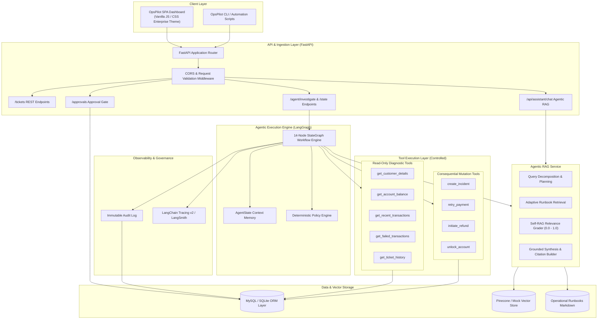
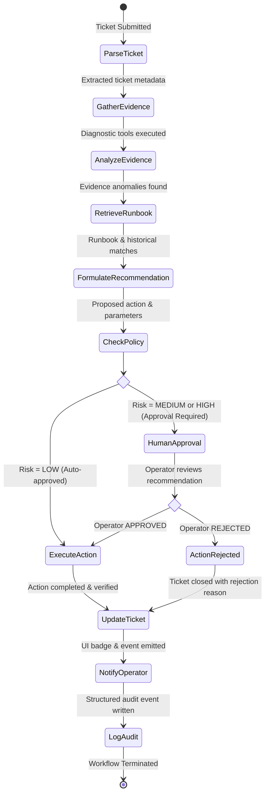
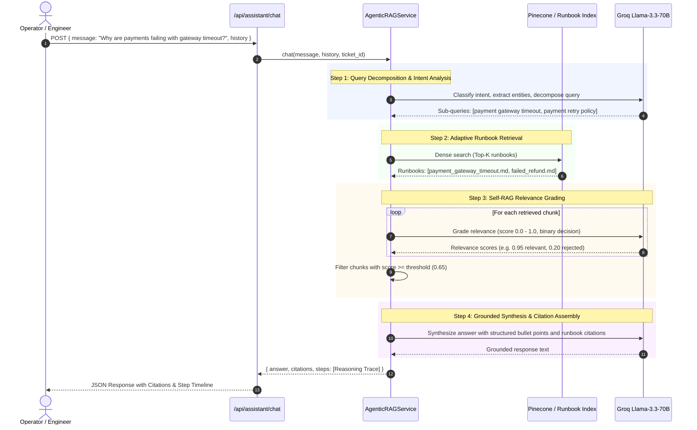
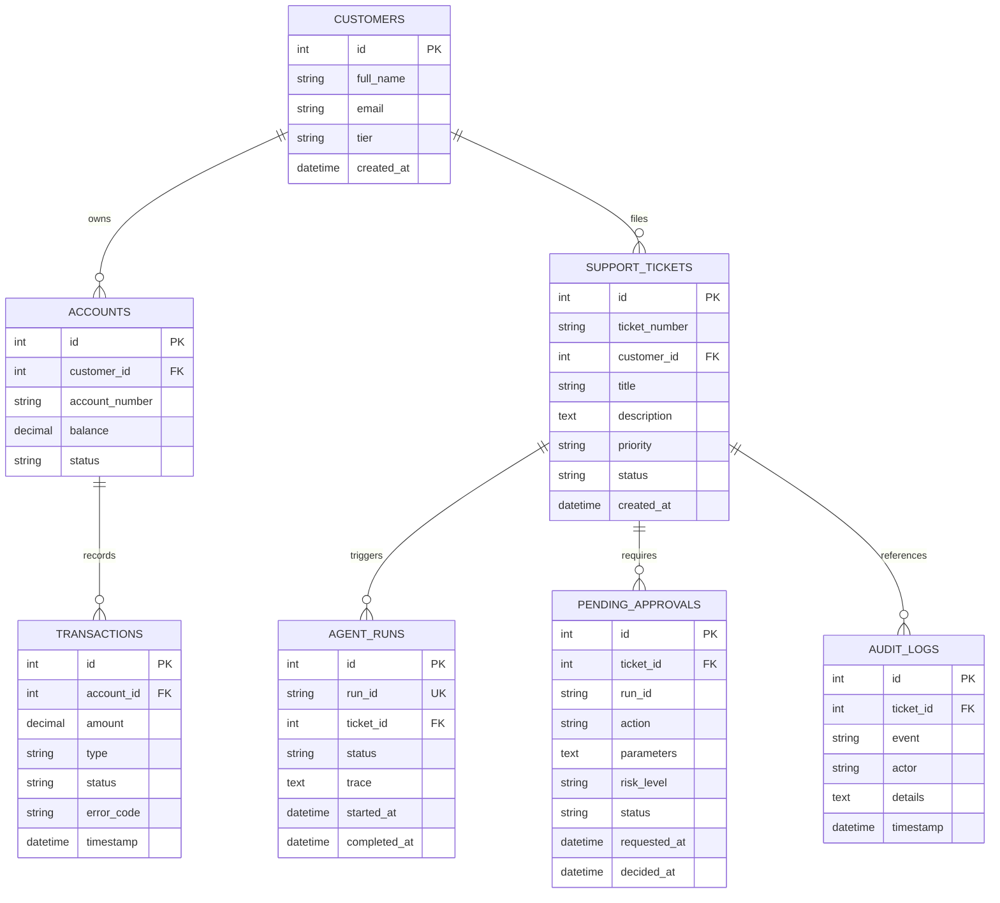
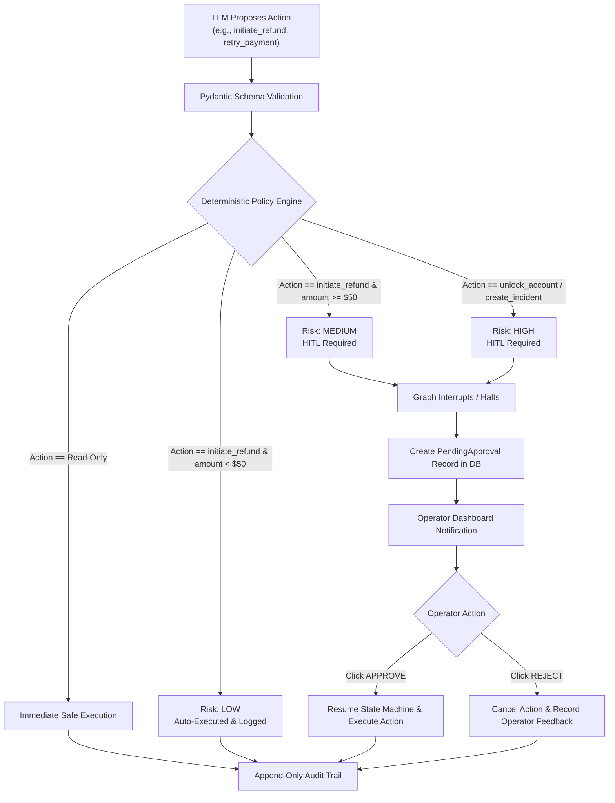

# OpsPilot — System Design & Architecture Document

OpsPilot is an enterprise-grade AI Operations Workflow Agent designed for automated IT and Fintech operations incident investigation, root-cause analysis, runbook retrieval (Agentic RAG), and controlled human-in-the-loop remediation.

---

## 1. System Overview & Core Objectives

Modern site-reliability and operations engineers spend up to 70% of incident resolution time performing repetitive diagnostic tasks: querying transaction ledgers, inspecting account states, searching for applicable operational runbooks, and submitting incident escalation tickets.

**OpsPilot** automates this end-to-end lifecycle with strict enterprise safety guarantees:
1. **Autonomous Diagnostic Investigation**: Orchestrated by a deterministic 14-node LangGraph state machine.
2. **Agentic RAG Engine**: Query decomposition, adaptive runbook retrieval, self-RAG relevance grading, and grounded multi-step reasoning traces.
3. **Deterministic Policy & Guardrails**: Hard rule engines evaluate risk levels before any mutation occurs; the LLM cannot directly trigger financial or infrastructure writes.
4. **Human-in-the-Loop (HITL)**: Medium and High-risk actions genuinely pause execution and require explicit cryptographic/operator approval.
5. **Full Observability & Auditability**: LangSmith traces every step, latency, and token; an append-only audit trail logs all operator and agent actions.

---

## 2. High-Level Architecture



---

## 3. LangGraph Workflow & State Machine

The investigation lifecycle is modeled as a directed acyclic graph (DAG) with conditional branch routing and checkpoint interrupts for human approval.



### Node Responsibilities:
| Node | Function | Output State Mutation |
|---|---|---|
| `parse_ticket` | Extracts customer ID, incident type, and symptoms from ticket description using Groq LLM with deterministic JSON parsing. | `customer_id`, `issue_type`, `symptoms` |
| `gather_evidence` | Invokes read-only diagnostic tools (`get_customer_details`, `get_failed_transactions`). | `evidence` dictionary |
| `analyze_evidence` | Correlates error codes (e.g. `ERR_GATEWAY_TIMEOUT`, `ERR_INSUFFICIENT_FUNDS`) and evaluates failure patterns. | `root_cause_hypothesis` |
| `retrieve_runbook` | Queries vector database with embedding of root cause hypothesis to retrieve relevant operational runbooks. | `runbook_text`, `runbook_id` |
| `formulate_recommendation` | Synthesizes evidence + runbook guidance into an action proposal (`create_incident`, `retry_payment`, `initiate_refund`, `unlock_account`). | `recommended_action`, `action_params` |
| `check_policy` | Deterministic policy engine assesses financial impact, blast radius, and assigns risk level (`LOW`, `MEDIUM`, `HIGH`). | `risk_level`, `requires_approval` |
| `human_approval` | **Interrupt Node**. Serializes state, registers `PendingApproval` record in database, and halts execution until operator decision. | `approval_status` |
| `execute_action` | Invokes the vetted write tool with Pydantic-validated parameters. | `execution_result` |
| `update_ticket` | Updates ticket status (`investigating` → `pending_approval` → `resolved`). | `ticket_status` |
| `notify_operator` | Emits UI notification payload and updates approval queue badges. | `notifications` |
| `log_audit` | Appends immutable record with actor attribution (`AGENT` or `OPERATOR`), timestamp, and full diff. | `audit_id` |

---

## 4. Agentic RAG Subsystem

OpsPilot incorporates an advanced **Agentic Retrieval-Augmented Generation (Self-RAG)** architecture to provide real-time runbook guidance and incident troubleshooting:



### Self-RAG Quality Checks:
- **Hallucination Mitigation**: Only runbook sections graded $\ge 0.65$ relevance are injected into the synthesis prompt.
- **Strict Evidence Grounding**: The LLM is instructed to cite explicit runbook filenames and sections (e.g., `payment_gateway_timeout.md`).
- **Explainability**: Every response includes an array of `steps` detailing decomposed sub-queries, retrieved files, relevance scores, and synthesis strategy.

---

## 5. Database Schema & Data Model

The data layer is built on SQLAlchemy ORM supporting both MySQL 8.0 (production) and SQLite (testing and local development).



---

## 6. Security, Safety & Human-in-the-Loop (HITL) Architecture



### Safety Rules:
1. **Separation of Capabilities**: Read-only tools cannot alter state; write tools are strictly segregated and require validation schemas.
2. **Zero Direct LLM Execution**: The LLM outputs structured proposals; the backend execution engine verifies parameters before calling backend Python functions.
3. **Audit Immutability**: Every action, whether automatic or manual, generates an immutable audit record containing actor attribution (`AGENT`, `OPERATOR`, `SYSTEM`).
4. **Environment Isolation**: Production credentials and API keys are strictly loaded via `.env` and never leaked into client bundles or LLM contexts.

---

## 7. Technology Stack Summary

| Layer | Technologies Used | Rationale |
|---|---|---|
| **Backend Framework** | FastAPI, Python 3.11+, Uvicorn | Asynchronous I/O, auto-generated OpenAPI documentation, fast execution. |
| **Agent Orchestration** | LangGraph, LangChain Core | Explicit state graph management, checkpointing, and human-in-the-loop pauses. |
| **LLM Provider** | Groq (Llama-3.3-70B-Versatile) | Sub-second inference latency critical for interactive multi-step agent graphs. |
| **RAG & Vectors** | Pinecone, Sentence-Transformers | High-performance semantic retrieval over operational runbooks. |
| **Database & ORM** | SQLAlchemy 2.0, MySQL 8.0 / SQLite | Robust relational modeling, ACID guarantees for audit and transactions. |
| **Frontend** | Vanilla JavaScript (ES6+), HTML5, Custom CSS | Zero-dependency SPA, lightning-fast rendering, lightweight deployment. |
| **Observability** | LangSmith (LangChain Tracing v2) | Distributed step tracing, token counting, latency breakdowns, and run replays. |
| **Deployment & CI** | Docker, Docker Compose, GitHub Actions | Multi-stage container builds, automated testing (50+ unit tests), reproducible CI. |

---

## 8. Verification & Test Suite

The project includes an end-to-end automated test suite covering:
- **`tests/test_agent.py`**: Node execution, state transitions, fallback behavior, and approval routing.
- **`tests/test_rag.py`**: Embedding generation, vector similarity search, and mock fallbacks.
- **`tests/test_tools.py`**: Read tools, write tools, schema validation, and policy engine risk evaluations.

All 50 tests run isolated against in-memory SQLite and mock embeddings without requiring external cloud dependencies:
```bash
pytest tests -v --tb=short
```
